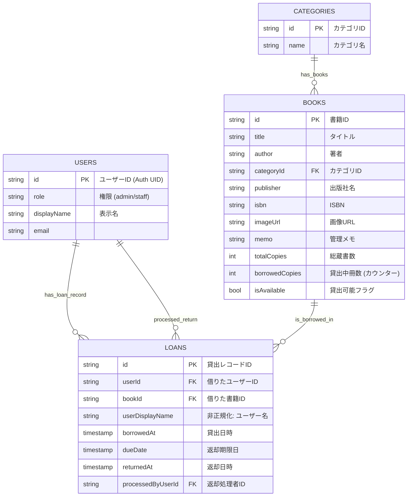

```mermaid
erDiagram
    %% ----------------------------------------------------
    %% エンティティの定義 (コレクション)
    %% ----------------------------------------------------

    USERS {
        string id PK "ユーザーID (Auth UID)"
        string role "権限 (admin/staff)"
        string displayName "表示名"
        string email
    }

    CATEGORIES {
        string id PK "カテゴリID"
        string name "カテゴリ名"
    }

    BOOKS {
        string id PK "書籍ID"
        string title "タイトル"
        string author "著者"
        string categoryId FK "カテゴリID"            
        string publisher "出版社名"                   
        string isbn "ISBN"                            
        string imageUrl "画像URL"                    
        string memo "管理メモ"                       
        int totalCopies "総蔵書数"
        int borrowedCopies "貸出中冊数 (カウンター)"
        bool isAvailable "貸出可能フラグ"
    }

    LOANS {
        string id PK "貸出レコードID"
        string userId FK "借りたユーザーID"
        string bookId FK "借りた書籍ID"
        string userDisplayName "非正規化: ユーザー名"
        timestamp borrowedAt "貸出日時"
        timestamp dueDate "返却期限日"
        timestamp returnedAt "返却日時"
        string processedByUserId FK "返却処理者ID"   
    }
    
    %% ----------------------------------------------------
    %% リレーションシップの定義 (1対多)
    %% ||--o{ : One to Zero-or-more
    %% ----------------------------------------------------
    
    USERS ||--o{ LOANS : has_loan_record
    BOOKS ||--o{ LOANS : is_borrowed_in
    CATEGORIES ||--o{ BOOKS : has_books
    USERS ||--o{ LOANS : processed_return
```