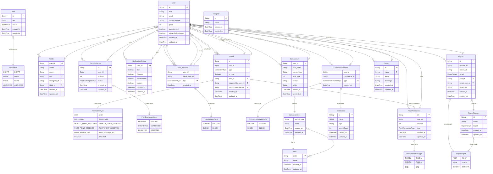

```mermaid
erDiagram

        NotificationType {
            LIKE LIKE
FOLLOWED FOLLOWED
BENEFIT_POINT_RECEIVED BENEFIT_POINT_RECEIVED
POST_POINT_RECEIVED POST_POINT_RECEIVED
POST_REVIEW_NG POST_REVIEW_NG
SYSTEM SYSTEM
        }
    


        PointExchangeStatus {
            PENDING PENDING
CONFIRMED CONFIRMED
REJECTED REJECTED
        }
    


        PointTransactionType {
            商品購入 商品購入
商品紹介 商品紹介
投稿 投稿
        }
    


        ReportTarget {
            POST POST
USER USER
BENEFIT BENEFIT
        }
    


        UserRelationType {
            FOLLOW FOLLOW
BLOCK BLOCK
        }
    


        CommercerRelationType {
            FOLLOW FOLLOW
BLOCK BLOCK
        }
    


        ItemStatus {
            DRAFT DRAFT
OPEN OPEN
DONE DONE
ARCHIVED ARCHIVED
        }
    
  "Todo" {
    String id "🗝️"
    String text 
    ItemStatus status 
    DateTime createdAt 
    DateTime updatedAt 
    }
  

  "User" {
    String id "🗝️"
    String sub 
    String email 
    String phone_number "❓"
    Int point 
    Boolean termsAgreed 
    Boolean privacyPolicyAgreed 
    DateTime created_at 
    DateTime updated_at 
    }
  

  "Profile" {
    String user_id "🗝️"
    String avatar "❓"
    String name 
    String bio "❓"
    String instagram_id "❓"
    String tiktok_id "❓"
    DateTime created_at 
    DateTime updated_at 
    }
  

  "Notice" {
    String id "🗝️"
    String user_id 
    NotificationType type 
    Boolean is_read 
    String post_id "❓"
    String triggered_by_user_id "❓"
    String point_transaction_id "❓"
    DateTime created_at 
    DateTime updated_at 
    }
  

  "NotificationSetting" {
    String user_id "🗝️"
    Boolean like 
    Boolean followed 
    Boolean achievement 
    Boolean system 
    DateTime created_at 
    DateTime updated_at 
    }
  

  "BankAccount" {
    String user_id "🗝️"
    String bank_code 
    String branch_code 
    Int bank_type 
    String number 
    String holder 
    DateTime created_at 
    DateTime updated_at 
    }
  

  "user_relations" {
    String user_id 
    String target_user_id 
    UserRelationType type "🗝️"
    DateTime created_at 
    }
  

  "CommercerRelation" {
    String user_id 
    String commercer_id 
    CommercerRelationType type "🗝️"
    DateTime created_at 
    }
  

  "PointExchange" {
    String id "🗝️"
    String user_id 
    Int amount 
    PointExchangeStatus status 
    DateTime created_at 
    DateTime updated_at 
    }
  

  "PointTransaction" {
    String id "🗝️"
    String user_id 
    Int amount 
    PointTransactionType type 
    DateTime created_at 
    DateTime updated_at 
    }
  

  "Commercer" {
    String id "🗝️"
    String name 
    String logo 
    Int benefitCount 
    DateTime created_at 
    DateTime updated_at 
    }
  

  "Contact" {
    String id "🗝️"
    String name "❓"
    String email 
    String message 
    DateTime created_at 
    DateTime updated_at 
    }
  

  "Report" {
    String id "🗝️"
    String reporter_id 
    String reason_id 
    ReportTarget target 
    String post_id "❓"
    String target_user_id "❓"
    String benefit_id "❓"
    DateTime created_at 
    DateTime updated_at 
    }
  

  "ReportReason" {
    String id "🗝️"
    String name 
    ReportTarget target 
    DateTime created_at 
    DateTime updated_at 
    }
  

  "Category" {
    String id "🗝️"
    String name 
    DateTime created_at 
    DateTime updated_at 
    }
  

  "Bank" {
    String code "🗝️"
    String name 
    DateTime created_at 
    DateTime updated_at 
    }
  

  "bank_branches" {
    String branch_code 
    String name 
    DateTime created_at 
    DateTime updated_at 
    }
  
    "Todo" o|--|| "ItemStatus" : "enum:status"
    "User" o{--}o "Profile" : ""
    "User" o{--}o "BankAccount" : ""
    "User" o{--}o "Notice" : ""
    "User" o{--}o "Notice" : ""
    "User" o{--}o "NotificationSetting" : ""
    "User" o{--}o "user_relations" : ""
    "User" o{--}o "user_relations" : ""
    "User" o{--}o "CommercerRelation" : ""
    "User" o{--}o "PointExchange" : ""
    "User" o{--}o "PointTransaction" : ""
    "User" o{--}o "Contact" : ""
    "User" o{--}o "Report" : ""
    "Profile" o|--|| "User" : "user"
    "Notice" o|--|| "User" : "user"
    "Notice" o|--|| "NotificationType" : "enum:type"
    "Notice" o|--|o "User" : "triggeredByUser"
    "Notice" o|--|o "PointTransaction" : "pointTransaction"
    "NotificationSetting" o|--|| "User" : "user"
    "BankAccount" o|--|| "User" : "user"
    "BankAccount" o|--|| "bank_branches" : "branch"
    "user_relations" o|--|| "UserRelationType" : "enum:type"
    "user_relations" o|--|| "User" : "user"
    "user_relations" o|--|| "User" : "targetUser"
    "CommercerRelation" o|--|| "CommercerRelationType" : "enum:type"
    "CommercerRelation" o|--|| "User" : "user"
    "CommercerRelation" o|--|| "Commercer" : "commercer"
    "PointExchange" o|--|| "User" : "user"
    "PointExchange" o|--|| "PointExchangeStatus" : "enum:status"
    "PointTransaction" o|--|| "User" : "user"
    "PointTransaction" o|--|| "PointTransactionType" : "enum:type"
    "Contact" o|--|o "User" : "user"
    "Report" o|--|| "User" : "reporter"
    "Report" o|--|| "ReportReason" : "reason"
    "Report" o|--|| "ReportTarget" : "enum:target"
    "ReportReason" o|--|| "ReportTarget" : "enum:target"
    "Bank" o{--}o "bank_branches" : ""
    "bank_branches" o|--|| "Bank" : "bank"
```