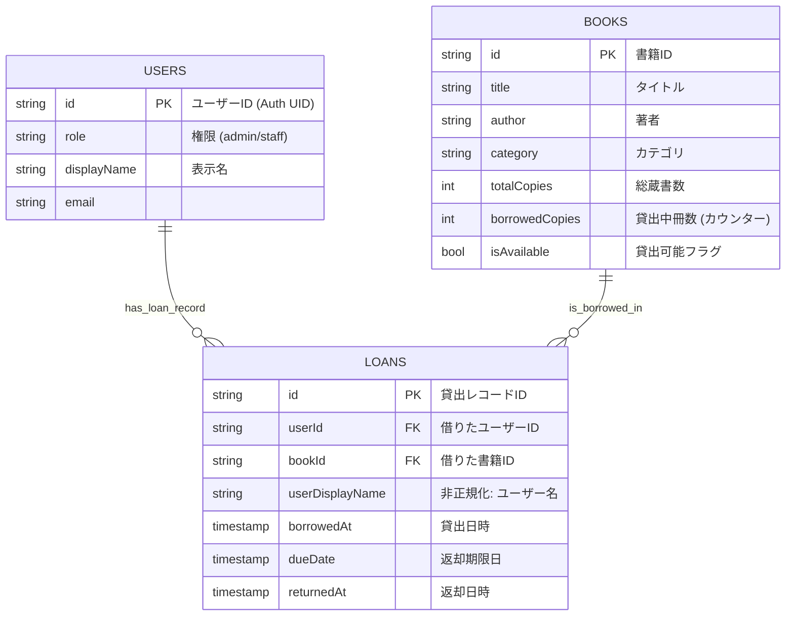

```mermaid
erDiagram
    %% ----------------------------------------------------
    %% エンティティの定義 (コレクション)
    %% ----------------------------------------------------

    USERS {
        string id PK "ユーザーID (Auth UID)"
        string role "権限 (admin/staff)"
        string displayName "表示名"
        string email
    }

    BOOKS {
        string id PK "書籍ID"
        string title "タイトル"
        string author "著者"
        string category "カテゴリ"
        int totalCopies "総蔵書数"
        int borrowedCopies "貸出中冊数 (カウンター)"
        bool isAvailable "貸出可能フラグ"
    }

    LOANS {
        string id PK "貸出レコードID"
        string userId FK "借りたユーザーID"
        string bookId FK "借りた書籍ID"
        string userDisplayName "非正規化: ユーザー名"
        timestamp borrowedAt "貸出日時"
        timestamp dueDate "返却期限日"
        timestamp returnedAt "返却日時"
    }
    
    %% ----------------------------------------------------
    %% リレーションシップの定義 (1対多)
    %% ||--o{ : One to Zero-or-more
    %% ----------------------------------------------------
    
    USERS ||--o{ LOANS : has_loan_record
    BOOKS ||--o{ LOANS : is_borrowed_in
```